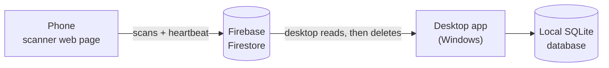

# Stock Tracker System

Track stock and expiry dates by scanning barcodes with a phone. Scans go to the cloud, and a Windows desktop app pulls them into a local database, matches each barcode to a named product, and highlights anything expired or about to expire.

- **Phone:** a web page that scans barcodes with the camera (or takes typed codes).
- **Cloud:** Google Firebase Firestore passes scans from the phone to the PC. It is free at this scale.
- **Desktop:** a Windows app that keeps the inventory, product catalog and expiry warnings.

---

## Contents

1. [How it works](#how-it-works)
2. [What you need](#what-you-need)
3. [Part 1 - Set up Firebase](#part-1---set-up-firebase)
4. [Part 2 - Host the phone page](#part-2---host-the-phone-page)
5. [Part 3 - Install the desktop app](#part-3---install-the-desktop-app)
6. [Part 4 - First-run setup](#part-4---first-run-setup)
7. [Part 5 - Pair the phone](#part-5---pair-the-phone)
8. [Using the app](#using-the-app)
9. [Product catalog](#product-catalog)
10. [Where your data lives, backups and security](#where-your-data-lives-backups-and-security)
11. [Building the installer](#building-the-installer)
12. [Running from source](#running-from-source)
13. [Troubleshooting](#troubleshooting)
14. [Project layout](#project-layout)
15. [Known limitations](#known-limitations)

---

## How it works



1. On the phone you scan a barcode, choose **Add** or **Remove**, and enter the expiry month and quantity. The page writes one small record to Firestore.
2. Every 30 seconds the desktop app reads the new records, applies them to its local database, and only *then* deletes them from Firestore. A network failure in between can never lose a scan.
3. Each scanned code is matched to a product through the **product catalog**, so a product's alias (barcode) and its internal item code both find the same stock.
4. The phone also sends a "heartbeat", so the desktop shows a green **Mobile connected** indicator while the phone is active.

The desktop app is the source of truth. Firestore is only a pipe between the phone and the PC.

---

## What you need

| Item | Notes |
|---|---|
| A Windows 10/11 PC | Runs the desktop app. The encrypted key storage uses Windows features. |
| A Google account | For Firebase. The free **Spark** plan is enough. |
| A phone with a browser | Chrome on Android or Safari on iPhone. Needs a camera and internet. |
| A place to host one web page | GitHub Pages is free and covered below. |
| For developers only | Python 3.10+ (tested on 3.13), and [Inno Setup 6](https://jrsoftware.org/isinfo.php) to build the installer. |

---

## Part 1 - Set up Firebase

Do this once. It takes about 15 minutes.

### 1.1 Create the project and database

1. Open the [Firebase console](https://console.firebase.google.com/) and click **Add project**. Name it anything (for example `stock-tracker`).
2. In the left menu open **Build → Firestore Database → Create database**. Pick any region and choose **Production mode**.
3. Wait until the database view appears. This step also switches on the Firestore API.

### 1.2 Publish the security rules

The rules let the phone *create* scans but never read or change anything.

1. In Firestore, open the **Rules** tab.
2. Delete everything in the editor and paste the full contents of [`firestore.rules`](firestore.rules).
3. Click **Publish** and wait for the confirmation. Pasting alone doesn't apply the rules.

### 1.3 Get the web app config (for the phone)

1. Click the gear icon → **Project settings → General**.
2. Scroll to **Your apps** and click the web icon `</>`. Give it any nickname and leave **Hosting** unchecked. Click **Register app**.
3. Copy the `const firebaseConfig = { ... };` block that appears. You will paste it into the desktop app in [Part 4](#part-4---first-run-setup).
   The `apiKey` in it is meant to be public. The rules, not secrecy, protect the database.

### 1.4 Create a limited service account key (for the desktop)

The desktop app needs a key to read and clear scans. **Do not use the default "Firebase Admin SDK" key**: it is far too powerful. Create a key that can only touch Firestore:

1. Open the [Google Cloud console](https://console.cloud.google.com/) and select the same project (top-left project picker).
2. **IAM & Admin → Service accounts → Create service account**. Name it `stock-tracker-desktop`.
3. **IAM & Admin → IAM → Grant access**. Enter the new account's email as the principal, give it the role **Cloud Datastore User** (exactly this role), and save.
   Granting the role on the *IAM* page is what matters. The optional role step in the creation wizard is easy to skip by accident.
4. Back in **Service accounts**, open the new account and go to **Keys → Add key → Create new key → JSON**. A `.json` file downloads. You will select it in [Part 4](#part-4---first-run-setup).
5. Wait a minute or two for permissions to spread.

> **Handle this file carefully.** Anyone holding it can read and delete your scan data. The app encrypts it on import and offers to delete the original, and you should never email it, commit it to git, or post it anywhere.

---

## Part 2 - Host the phone page

Phone browsers only allow camera access on **HTTPS** pages, so the page can't just be opened from a file. Host it somewhere free.

### Option A - GitHub Pages (recommended)

1. Create a GitHub account and a **new public repository** (for example `StockTrackerSystem`).
2. Push this project to it. The included [`.gitignore`](.gitignore) keeps your key file, database and other private files out. Check with `git status --ignored` before your first `git add`.
3. In the repository go to **Settings → Pages**. Set **Source** to **Deploy from a branch**, choose `main` and `/ (root)`, and save.
4. After a minute or two the page is live at:

   ```
   https://<your-username>.github.io/<repository-name>/
   ```

   The root [`index.html`](index.html) forwards to the scanner page, [`src/mobile_scanner_app.html`](src/mobile_scanner_app.html). You can also open that address directly.

To publish changes later, commit and push. Pages can take a minute or two to update.

> **Public repositories are visible to everyone.** That's fine here: the page contains no secrets, and the Firebase config reaches a phone only through the pairing QR. Never commit the service account key. If it was ever committed, delete that key in Google Cloud and create a new one.

### Option B - Firebase Hosting

Install [Node.js](https://nodejs.org) and the tools (`npm install -g firebase-tools`), run `firebase login`, then `firebase init hosting` in a folder holding the page as `index.html`, and `firebase deploy`. You get an `https://<project>.web.app` address.

---

## Part 3 - Install the desktop app

### Using the installer (normal way)

1. Get `StockTracker-Setup-<version>.exe` (see [Building the installer](#building-the-installer)) and run it.
2. Windows may show **"Windows protected your PC"** because the installer isn't code-signed. Click **More info → Run anyway**.
3. It installs for your user account only, with no administrator rights needed. You can choose a desktop shortcut and launch the app at the end.

Updating is the same: run a newer setup file on top. Your data is kept.

### Uninstalling

Use **Settings → Apps → Stock Tracker → Uninstall**. It asks whether to delete your stock data and saved credentials as well. Choose **No** if you might reinstall.

---

## Part 4 - First-run setup

The first time the app opens, a setup window appears.

1. **Firebase Service Account Key:** click **Choose key file…** and select the `.json` key from step 1.4.
   - The app tests the key against Firestore, then asks you to confirm. The confirmation shows the project and account name, never the key itself.
   - It then encrypts the key for your Windows account and offers to delete the original file. Say **Yes**.
2. **Firebase Web Config:** paste the `const firebaseConfig = { ... };` block from step 1.3. Pasting it exactly as the console shows it is fine.
3. **Expiring-soon warning:** choose **30, 60 or 90 days**. Stock expiring inside that window is highlighted yellow. You can change this later in **⚙ Settings**.
4. Click **Test Connection** to check everything, then **Save and Open Dashboard**.

If the app finds an old plain-text `service_account.json`, it offers to encrypt it and delete the plain file.

---

## Part 5 - Pair the phone

1. On the desktop, click **📱 Connect Mobile**. A QR code appears.
2. On the phone, open your hosted page from Part 2 in **Chrome or Safari** (not inside another app's built-in browser).
3. Allow camera access, then point the camera at the QR code.
4. The page changes to the scanner and shows **Connected** at the top. Within about 30 seconds the desktop's indicator turns green: **● Mobile connected**.

If the camera won't work, take a screenshot of the QR on the desktop, send it to the phone, and tap **Scan an Image File** on the page. Pairing needs no camera that way.

Pairing is remembered per web address on the phone. Pair once using the final address you will use every day. **Disconnect** (top right on the phone) forgets the pairing.

---

## Using the app

### On the phone

1. Scan a barcode with the camera, or type it in **Or enter manually**.
2. Choose **Add to Stock** or **Remove (Expired/Damaged)**.
3. Set the **Expiry** month and the **Quantity**.
4. Tap **Sync to Queue**. The entry appears under **Recent Syncs**.

The sun/moon button in the header switches light and dark mode. Under **Troubleshooting** there is a **Run connection test** button (see [Troubleshooting](#troubleshooting)).

### On the desktop

The dashboard lists every stock row with its product name, alias, item code, expiry, quantity and status.

| Row colour | Meaning |
|---|---|
| Red | Expired |
| Yellow | Expires within your expiring-soon window |
| Normal | Fine |

New scans arrive automatically every 30 seconds, or click **↻ Refresh**.

**Toolbar**

| Button | What it does |
|---|---|
| 📦 Products | Open the [product catalog](#product-catalog) |
| ⚠ Pending scans (N) | Resolve scans that matched more than one product (turns orange when there are some) |
| 🗑 Remove Selected | Delete the selected stock rows |
| 📱 Connect Mobile | Show the pairing QR code |
| ⚙ Settings | Expiring-soon window, replace the Firebase key, version |
| 🛠 Dev Tools | Reset the app to first-run state (keeps your stored Firebase key) |
| ☾ Dark mode / ☀ Light mode | Switch theme. The choice is remembered. |

**Right-click a row**

- **✎ Edit information…** is available when exactly **one** row is selected, and grayed out when several are.
  - *Name, Alias / barcode and Item code* belong to the product, so they change **everywhere** that product appears.
  - *Expiry* (`YYYY-MM`) and *Quantity* change only that stock row.
  - Before anything is saved you see exactly what will change and must confirm.
  - An edit is refused, with an explanation, if it would give a product the exact item code and alias of another product, or give a product two stock rows with the same expiry.
- **🗑 Remove selected** works on any number of rows, and asks for confirmation.

Manual edits and removals count as stock changes. That turns off *Undo last import* (see below).

---

## Product catalog

By default a scan only knows its barcode. The catalog teaches the app which barcode belongs to which named product, and lets both a product's **alias** (barcode) and its **item code** find the same stock.

### Importing a product list

1. Click **📦 Products → Import CSV…** and choose your file (comma, tab, semicolon or pipe separated).
2. **Choose which column is which:** Alias (barcode), Item Code (internal SKU) and Item Description (product name). Column names and order can differ from file to file. The app pre-selects likely columns and remembers your choice for files with the same headers.
3. Click **Preview changes**. You see counts of new products, renamed products and anything skipped, plus samples. Nothing has changed yet.
4. Click **Import**.

### The rules

- **A product is identified by its item code + alias pair.** Importing a row with the same pair *updates the description*. A blank description never erases an existing name.
- **Imports never delete anything.** Products missing from a newer file stay.
- **The same code under a different alias becomes a separate product.** Scanning that shared code then asks you to choose (see Pending scans).
- **Matching ignores case, spaces and leading zeros** in all-digit codes, so a UPC-A code and its EAN-13 form match.
- **Excel damage is detected:** values like `9.32877E+12` (a barcode Excel shortened) are ignored and counted in the preview. Export your list so barcode cells keep their full digits.
- Rows with neither an alias nor an item code are skipped.

### Scans the catalog can't place

- **Unknown code:** the stock is recorded under an **(unnamed product)**. When a later import contains that code, the stock is folded into the real product automatically.
- **A code that matches several products:** the scan waits under **⚠ Pending scans**. Select it, pick the right product by name, and choose **Assign to selected product**. You are asked every time.

### Undo

**Undo last import** (in the Products window) restores the products and stock to how they were before the most recent import. It works **only until stock next changes** (a scan is applied, a pending scan is resolved, or a row is edited or removed), because restoring older data after that would silently lose stock.

---

## Where your data lives, backups and security

### Where files are kept

| Installed app | Location |
|---|---|
| Stock database | `%LOCALAPPDATA%\StockTracker\database\store_inventory.db` |
| Encrypted Firebase key | `%LOCALAPPDATA%\StockTracker\config\firebase_credentials.dat` |
| Error log (if anything goes wrong) | `%LOCALAPPDATA%\StockTracker\error.log` |

Run from source, these live in `database\` and `config\` inside the project folder instead.

### Backups

Copy `store_inventory.db` to back it up (close the app first for the safest copy). The first time an older database is upgraded to the catalog format, the app also saves `store_inventory.db.pre-catalog.bak` beside it.

To move to another PC: install the app there, then run first-run setup again. The encrypted key file only works on the PC and Windows account that created it, so import the key file again on the new machine.

### Security model

| What | How it is protected |
|---|---|
| The service account key | Encrypted with Windows data protection for your account. Not shown in the app. Can only be added or replaced through the app, with a confirmation. |
| Its power | Limited to Firestore by the **Cloud Datastore User** role. |
| The phone | Can only *create* scan records and a heartbeat. It can't read, change or delete anything. |
| The Firebase web config | Public by design. It identifies the project but grants no access beyond the rules. |

Be aware of these limits:

- Anyone signed into your Windows account, or malware running as you, can still use the key, because the app itself must decrypt it. That's why its role is restricted.
- The pairing token is a shared secret in the QR code, not real per-device authentication. Someone who knew your project's public config could write fake scan records. They could not read or delete anything, and you would see and could correct any bogus stock.
- Overwriting deleted files is best effort. If a key file was ever left in Downloads or committed to git, **delete that key in Google Cloud** (Service accounts → Keys) and import a new one.

**Rotating the key:** create a new key (step 1.4), import it in **⚙ Settings → Replace key file…**, then delete the old key in Google Cloud.

---

## Building the installer

You need Windows, Python 3.10+ and [Inno Setup 6](https://jrsoftware.org/isinfo.php) (`winget install JRSoftware.InnoSetup`).

```powershell
powershell -ExecutionPolicy Bypass -File installer\build.ps1
```

The script does everything:

1. Creates a private build environment in `.venv` and installs the dependencies and PyInstaller.
2. Generates the app icon.
3. Packages the app into `dist\StockTracker\StockTracker.exe`.
4. **Runs a self-test on the packaged app** (GUI, QR codes, Windows encryption, database, Firebase client) and stops if anything is missing.
5. Builds `installer\Output\StockTracker-Setup-<version>.exe`.

Add `-SkipInstaller` to stop after step 4.

**For each release:** raise `APP_VERSION` in [`src/app_paths.py`](src/app_paths.py) and rebuild. Installing the new setup over the old one upgrades in place and keeps data.

**Before shipping to a client:**

- Set your name or company as the publisher in [`installer/StockTracker.iss`](installer/StockTracker.iss) (`AppPublisher`).
- The installer is unsigned, so Windows SmartScreen warns on first run. Removing the warning needs a code-signing certificate.
- Each PC needs its own first-run setup and its own imported key.

---

## Running from source

```powershell
python -m pip install -r requirements.txt
python src\pc_backend_automation_service.py
```

Data stays in the project's `database\` and `config\` folders. Windows is required (the key storage uses the Windows data protection API).

---

## Troubleshooting

### Phone

| Problem | Fix |
|---|---|
| **Camera permission is denied automatically (Android)** | Tap the icon left of the address → **Permissions → Camera → Allow**, then reload. Also check Android **Settings → Apps → Chrome → Permissions → Camera**, and Chrome **Settings → Site settings → Camera** (should be "Ask first"). Open the link in Chrome itself, not inside WhatsApp, email or another app. |
| "NotReadableError: Device in use" | Another tab or app is using the camera. Close it and retry, or use **Scan an Image File** instead. |
| Camera doesn't work at all | The page must be served over **HTTPS** (Part 2). |
| The button stays on "Syncing…" or a timeout message appears | Open **Troubleshooting → Run connection test** on the page and read its result (next table). |
| Setup mode shows again after reopening | Pairing is stored per web address. Use the same address every time, and pair with it. |

**Run connection test results**

| Result | Meaning |
|---|---|
| "Request failed before reaching Google" | No internet, or something (VPN, ad-blocker, work network) blocks `firestore.googleapis.com`. |
| `HTTP 404` | The Firestore database doesn't exist. Create it (step 1.1). |
| `HTTP 403` with a rules message | The rules aren't published or don't match. Redo step 1.2 and click **Publish**. |
| `HTTP 403`, "CONSUMER_INVALID" | The pairing config has the wrong project ID (often placeholder text). Re-enter the real web config on the desktop and re-pair. |
| `HTTP 200` / OK | Firestore and the rules work. |

### Desktop

| Problem | Fix |
|---|---|
| "**Cloud Firestore API has not been used… or it is disabled**" | Create the database in the Firebase console (step 1.1). Wait a few minutes. |
| Key import: "**403 Missing or insufficient permissions**" | The new service account lacks the role. Grant **Cloud Datastore User** on the IAM page (step 1.4), wait a minute, and import again. Nothing was changed by the failed attempt. |
| Web config is rejected | Paste the whole `firebaseConfig` block. Placeholder values like `"..."` are refused. |
| "The stored Firebase credentials can't be decrypted" | The key was saved under a different Windows account or PC. Use **⚙ Settings → Replace key file…** (or the setup window) and import it again. |
| The **Mobile connected** indicator stays grey | It checks every 30 seconds and shows connected only if the phone sent a heartbeat in the last 2 minutes. A locked or backgrounded phone pauses its page, so keep the page open. Confirm pairing shows **Connected** on the phone. |
| Scans arrive but show "(unnamed product)" | The barcode isn't in the catalog yet. Import your product list (Product catalog). |
| A scan is missing from the table | Check **⚠ Pending scans**: a code matching several products waits there. |
| **Undo last import** is grayed out | Stock has changed since that import. See [Undo](#undo). |
| Import preview says values were ignored "as scientific notation" | The spreadsheet damaged the barcodes. Re-export with barcode cells stored as text. |
| Windows says "Windows protected your PC" | The installer is unsigned. Click **More info → Run anyway**. |
| The app closed unexpectedly | Look at `%LOCALAPPDATA%\StockTracker\error.log` for the details. |

---

## Project layout

```
StockTrackerSystem/
├── index.html                  Forwards the site root to the scanner page (GitHub Pages)
├── firestore.rules             Security rules to publish in Firebase (step 1.2)
├── requirements.txt            Python dependencies
├── src/
│   ├── pc_backend_automation_service.py   The desktop app: dashboard, sync, setup, windows
│   ├── product_catalog.py      Product matching, imports, edits, undo, pending scans
│   ├── secure_store.py         Encrypted storage for the Firebase key (Windows)
│   ├── ui_theme.py             Light/dark theming for the desktop app
│   ├── app_paths.py            Where files live (project folders vs installed) + app version
│   ├── mobile_scanner_app.html The phone scanner page
│   └── backend_sync.py         Empty placeholder, unused
└── installer/
    ├── build.ps1               One-command build: package, self-test, installer
    ├── stock_tracker.spec      PyInstaller recipe
    ├── StockTracker.iss        Inno Setup installer script
    └── make_icon.py            Generates the app icon
```

---

## Known limitations

- **Windows only** for the desktop app.
- **Firebase key on every PC.** Each installation holds an encrypted, Firestore-only service account key. A stronger design would replace it with a sign-in that has no admin power at all, using Firebase Authentication and rules that allow one user to read and delete only scan records. That would be a larger change to how the desktop talks to Firestore.
- **The phone gets no feedback** when a scan is unknown or ambiguous. That is decided on the desktop and shown there.
- **One phone-to-PC pairing model:** all phones paired from the same desktop share one token.
- **Undo covers only the most recent import**, and only until stock next changes.
- **Free-plan limits:** Firestore's free tier is generous (tens of thousands of reads and writes per day). This app uses roughly 6,000 reads per day per desktop, so a normal shop won't come close.
