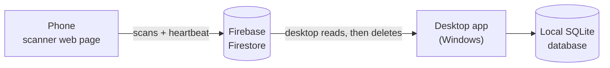

# Stock Tracker System

Track stock and expiry dates by scanning barcodes with a phone. Scans go to the cloud, and a Windows desktop app pulls them into a local database, matches each barcode to a named product, and highlights anything expired or about to expire.

- **Phone:** a web page that scans barcodes with the camera (or takes typed codes).
- **Cloud:** Google Firebase Firestore passes scans from the phone to the PC. It is free at this scale.
- **Desktop:** a Windows app that keeps the inventory, product catalog and expiry warnings.

---

## Contents

1. [How it works](#how-it-works)
2. [What you need](#what-you-need)
3. [Part 1 - Set up Firebase](#part-1---set-up-firebase)
4. [Part 2 - Host the phone page](#part-2---host-the-phone-page)
5. [Part 3 - Install the desktop app](#part-3---install-the-desktop-app)
6. [Part 4 - First-run setup](#part-4---first-run-setup)
7. [Part 5 - Pair the phone](#part-5---pair-the-phone)
8. [Using the app](#using-the-app)
9. [Exporting the expiry list](#exporting-the-expiry-list)
10. [Stock history](#stock-history)
11. [Product catalog](#product-catalog)
12. [Where your data lives, backups and security](#where-your-data-lives-backups-and-security)
13. [Updating the app](#updating-the-app)
14. [Building and publishing a release](#building-and-publishing-a-release)
15. [Running from source](#running-from-source)
16. [Troubleshooting](#troubleshooting)
17. [Project layout](#project-layout)
18. [Known limitations](#known-limitations)

---

## How it works



1. On the phone you scan a barcode, choose **Add** or **Remove**, and enter the expiry month and quantity. The page writes one small record to Firestore.
2. Every 30 seconds the desktop app reads the new records, applies them to its local database, and only *then* deletes them from Firestore. A network failure in between can never lose a scan.
3. Each scanned code is matched to a product through the **product catalog**, so a product's alias (barcode) and its internal item code both find the same stock.
4. The phone also sends a "heartbeat", so the desktop shows a green **Mobile connected** indicator while the phone is active.

The desktop app is the source of truth. Firestore is only a pipe between the phone and the PC.

---

## What you need

| Item | Notes |
|---|---|
| A Windows 10/11 PC | Runs the desktop app. The encrypted key storage uses Windows features. |
| A Google account | For Firebase. The free **Spark** plan is enough. |
| A phone with a browser | Chrome on Android or Safari on iPhone. Needs a camera and internet. |
| A place to host one web page | GitHub Pages is free and covered below. |
| For developers only | Python 3.10+ (tested on 3.13), and [Inno Setup 6](https://jrsoftware.org/isinfo.php) to build the installer. |

---

## Part 1 - Set up Firebase

Do this once. It takes about 15 minutes.

### 1.1 Create the project and database

1. Open the [Firebase console](https://console.firebase.google.com/) and click **Add project**. Name it anything (for example `stock-tracker`).
2. In the left menu open **Build → Firestore Database → Create database**. Pick any region and choose **Production mode**.
3. Wait until the database view appears. This step also switches on the Firestore API.

### 1.2 Publish the security rules

The rules let the phone *create* scans but never read or change anything.

1. In Firestore, open the **Rules** tab.
2. Delete everything in the editor and paste the full contents of [`firestore.rules`](firestore.rules).
3. Click **Publish** and wait for the confirmation. Pasting alone doesn't apply the rules.

### 1.3 Get the web app config (for the phone)

1. Click the gear icon → **Project settings → General**.
2. Scroll to **Your apps** and click the web icon `</>`. Give it any nickname and leave **Hosting** unchecked. Click **Register app**.
3. Copy the `const firebaseConfig = { ... };` block that appears. You will paste it into the desktop app in [Part 4](#part-4---first-run-setup).
   The `apiKey` in it is meant to be public. The rules, not secrecy, protect the database.

### 1.4 Create a limited service account key (for the desktop)

The desktop app needs a key to read and clear scans. **Do not use the default "Firebase Admin SDK" key**: it is far too powerful. Create a key that can only touch Firestore:

1. Open the [Google Cloud console](https://console.cloud.google.com/) and select the same project (top-left project picker).
2. **IAM & Admin → Service accounts → Create service account**. Name it `stock-tracker-desktop`.
3. **IAM & Admin → IAM → Grant access**. Enter the new account's email as the principal, give it the role **Cloud Datastore User** (exactly this role), and save.
   Granting the role on the *IAM* page is what matters. The optional role step in the creation wizard is easy to skip by accident.
4. Back in **Service accounts**, open the new account and go to **Keys → Add key → Create new key → JSON**. A `.json` file downloads. You will select it in [Part 4](#part-4---first-run-setup).
5. Wait a minute or two for permissions to spread.

> **Handle this file carefully.** Anyone holding it can read and delete your scan data. The app encrypts it on import and offers to delete the original, and you should never email it, commit it to git, or post it anywhere.

---

## Part 2 - Host the phone page

Phone browsers only allow camera access on **HTTPS** pages, so the page can't just be opened from a file. Host it somewhere free.

### Option A - GitHub Pages (recommended)

1. Create a GitHub account and a **new public repository** (for example `StockTrackerSystem`).
2. Push this project to it. The included [`.gitignore`](.gitignore) keeps your key file, database and other private files out. Check with `git status --ignored` before your first `git add`.
3. In the repository go to **Settings → Pages**. Set **Source** to **Deploy from a branch**, choose your default branch (`main` or `master`) and `/ (root)`, and save.
4. After a minute or two the page is live at:

   ```
   https://<your-username>.github.io/<repository-name>/
   ```

   The root [`index.html`](index.html) forwards to the scanner page, [`src/mobile_scanner_app.html`](src/mobile_scanner_app.html). You can also open that address directly.

To publish changes later, commit and push. Pages can take a minute or two to update.

> **Public repositories are visible to everyone.** That's fine here: the page contains no secrets, and the Firebase config reaches a phone only through the pairing QR. Never commit the service account key. If it was ever committed, delete that key in Google Cloud and create a new one.

### Option B - Firebase Hosting

Install [Node.js](https://nodejs.org) and the tools (`npm install -g firebase-tools`), run `firebase login`, then `firebase init hosting` in a folder holding the page as `index.html`, and `firebase deploy`. You get an `https://<project>.web.app` address.

---

## Part 3 - Install the desktop app

### Using the installer (normal way)

1. Get `StockTracker-Setup-<version>.exe` (see [Building the installer](#building-the-installer)) and run it.
2. Windows may show **"Windows protected your PC"** because the installer isn't code-signed. Click **More info → Run anyway**.
3. It installs for your user account only, with no administrator rights needed. You can choose a desktop shortcut and launch the app at the end.

Updating is the same: run a newer setup file on top. Your data is kept.

### Uninstalling

Use **Settings → Apps → Stock Tracker → Uninstall**. It asks whether to delete your stock data and saved credentials as well. Choose **No** if you might reinstall.

---

## Part 4 - First-run setup

The first time the app opens, a setup window appears.

1. **Firebase Service Account Key:** click **Choose key file…** and select the `.json` key from step 1.4.
   - The app tests the key against Firestore, then asks you to confirm. The confirmation shows the project and account name, never the key itself.
   - It then encrypts the key for your Windows account and offers to delete the original file. Say **Yes**.
2. **Firebase Web Config:** paste the `const firebaseConfig = { ... };` block from step 1.3. Pasting it exactly as the console shows it is fine.
3. **Expiring-soon warning:** choose **30, 60 or 90 days**. Stock expiring inside that window is highlighted yellow. You can change this later in **⚙ Settings**.
4. Click **Test Connection** to check everything, then **Save and Open Dashboard**.

If the app finds an old plain-text `service_account.json`, it offers to encrypt it and delete the plain file.

---

## Part 5 - Pair the phone

1. On the desktop, click **📱 Connect Mobile**. The window shows two QR codes side by side.
2. **Check the phone page address.** The **Phone page address** field is pre-filled with `https://dtmhlol.github.io/StockTrackerSystem/`, the page hosted for this project, so normally there is nothing to do. If you host your own copy (Part 2), replace it with your address and click **Save**; the app remembers it. It must start with `https://`, because phone browsers only allow the camera on secure pages.
   To change the built-in default for your own builds, edit `DEFAULT_MOBILE_APP_URL` in [`src/app_paths.py`](src/app_paths.py).
3. **QR 1, "Open the app":** scan it with the phone's normal camera app. It opens the scanner page in the phone's browser, so nobody has to type the address.
   Prefer Chrome or Safari over the built-in browser of another app.
4. Allow camera access when the page asks.
5. **QR 2, "Pair with this PC":** on the page's "Scan Desktop QR to Connect" screen, scan the second code.
6. The page changes to the scanner and shows **Connected** at the top. Within about 30 seconds the desktop's indicator turns green: **● Mobile connected**.

**Copy address** and **Copy pairing details** under the codes copy the same information as text, for sending to a phone by message.

If the camera won't work, take a screenshot of the pairing QR on the desktop, send it to the phone, and tap **Scan an Image File** on the page. Pairing needs no camera that way.

Pairing is remembered per web address on the phone. Pair once using the final address you will use every day. **Disconnect** (top right on the phone) forgets the pairing.

---

## Using the app

### On the phone

1. Scan a barcode with the camera, or type it in **Or enter manually**.
2. Choose **Add to Stock** or **Remove (Expired/Damaged)**.
3. Set the **Expiry** month and the **Quantity**.
4. Tap **Sync to Queue**. The entry appears under **Recent Syncs**.

The sun/moon button in the header switches light and dark mode. Under **Troubleshooting** there is a **Run connection test** button (see [Troubleshooting](#troubleshooting)).

### On the desktop

The dashboard lists every stock row with its product name, alias, item code, expiry, quantity and status.

| Row colour | Meaning |
|---|---|
| Red | Expired |
| Yellow | Expires within your expiring-soon window |
| Normal | Fine |

New scans arrive automatically every 30 seconds, or click **↻ Refresh**.

**Toolbar**

| Button | What it does |
|---|---|
| 📦 Products | Open the [product catalog](#product-catalog) |
| ⚠ Pending scans (N) | Resolve scans that matched more than one product (turns orange when there are some) |
| ⬇ Export | Save the expiry list as a [PDF or CSV](#exporting-the-expiry-list) |
| 🕘 History | Browse and export the [stock history](#stock-history) |
| 📱 Connect Mobile | Show the "open the app" and pairing QR codes, and set the phone page address |
| ⚙ Settings | Expiring-soon window, [replace or reset the product catalog](#replacing-or-resetting-the-catalog), replace the Firebase key, [check for updates](#updating-the-app) |
| 🛠 Dev Tools | Reset the app to first-run state (keeps your stored Firebase key and the stock history) |
| ☾ Dark mode / ☀ Light mode | Switch theme. The choice is remembered. |

**Just above the table**

| Button | What it does |
|---|---|
| ＋ Add Item (Ctrl+N) | [Add stock by hand](#adding-an-item-by-hand) |
| 🗑 Remove Selected | Delete the selected stock rows |
| ↻ Refresh | Fetch new scans now and redraw the table |

**Right-click a row**

- **✎ Edit information…** is available when exactly **one** row is selected, and grayed out when several are.
  - *Name, Alias / barcode and Item code* belong to the product, so they change **everywhere** that product appears.
  - *Expiry* (`YYYY-MM`) and *Quantity* change only that stock row.
  - Before anything is saved you see exactly what will change and must confirm.
  - An edit is refused, with an explanation, if it would give a product the exact item code and alias of another product, or give a product two stock rows with the same expiry.
- **🗑 Remove selected** works on any number of rows, and asks for confirmation.

**Small screens.** Every window fits the space above the taskbar and opens centred on the screen. Its action buttons (Import, Save, Close and so on) are pinned to the bottom edge and always visible. If a window's content is taller than the screen, the content scrolls (scrollbar or mouse wheel) while the buttons stay put. The main window can be resized, and its table shrinks to fit.

Manual adds, edits and removals count as stock changes. That turns off *Undo last change* (see below).

### Adding an item by hand

Use this for stock that didn't come through the phone, for example something you find on a shelf that is close to expiring. Click **＋ Add Item** (or press Ctrl+N).

| Field | Notes |
|---|---|
| **Barcode / code** | The barcode (alias) or the item code. As you type, the window tells you whether the catalog knows it. If it does, the product's name is filled in and locked. |
| **Product name** | Only needed for a code the catalog doesn't know. Enter a name to create a new product, or leave it blank to add the stock as an **(unnamed product)**, the same as an unknown scan. If the code is known only as an unnamed product, entering a name fills it in. |
| **Expiry (month)** | `2027-03` or `03/2027`. The window shows straight away whether that month counts as good, expiring soon or expired. Years must be 2000 to 2099. |
| **Quantity** | A whole number, 1 or more. |

- The item is added **exactly like a scan**: if that product already has a row for the same expiry, its quantity goes up. The window shows "4 now, 10 after adding" before you click.
- If the code matches **several products**, a list appears and you choose which one. Nothing is added until you do.
- Tick **Keep this window open to add another** to enter a run of items. The expiry stays filled in.
- The new row is selected in the table. In [History](#stock-history) it appears as **Manual add**, source `desktop`, so it can always be told apart from a scan.

---

## Exporting the expiry list

Click **⬇ Export** on the dashboard to save the expiry list as a **PDF** (for printing or sharing) or a **CSV** (for Excel).

| Choice | Options |
|---|---|
| **Status** | Tick any of **Expired**, **Expiring soon**, **Good**, **Invalid date**. All are ticked by default. |
| **Months** | Pick a **From** and **To** month from the months that exist in your stock. Choose the same month in both to export a single month. Leave both on *Any month* for everything. |
| **Group by** | *No grouping*, *Status* (Expired, then Expiring soon, then Good) or *Month* (oldest first). Each group gets a heading with its item and unit counts. |
| **Sort by / Then by** | Any column, ascending or descending: Sys ID, Product, Alias / Barcode, Item Code, Expiry, Quantity or Status. Sorting ignores case and puts `A20` before `A100`. Within groups, the sort applies inside each group. |
| **File format** | PDF or CSV. |

A line at the bottom of the filters always tells you how many items and units will be exported, and warns you if the choices match nothing. Then click **Export**, choose where to save it, and the app offers to open the file.

**The PDF** is landscape A4 with a title, the filters and sort used, a summary of expired / expiring / good counts, and the table. Rows are shaded by status, column headings repeat on every page, and every page is numbered ("Page 2 of 5").

**The CSV** opens in Excel with accents intact. Tick **Keep long barcodes and leading zeros intact in Excel** (on by default) and codes such as `0123456` or `9300675057899` display exactly as they are instead of turning into `9.3E+12`. Untick it for plain CSV, for example to import the file into another system. When you group, the CSV gets an extra **Group** column.

**What "expired" means.** The dashboard and the export use the same rule. Stock is counted from the **first day** of its expiry month, so stock stamped with the current month already counts as expired, and "expiring soon" means within your chosen 30/60/90-day window. The rule lives in one function, `status_for` in [`src/expiry_report.py`](src/expiry_report.py), if you ever want it to count to the end of the month instead.

---

## Stock history

Every change to stock is recorded in a log that can't be edited or deleted from the app, so it is a reliable record and a good source for analysis. Click **🕘 History** on the dashboard.

**What is recorded** (one row per event, saved in the same step as the change itself, so the log can never disagree with the stock):

| Event | When |
|---|---|
| `SCAN_ADD` / `SCAN_REMOVE` | A phone scan changed stock (including scans of unknown codes) |
| `SCAN_HELD` | A scan matched several products and is waiting under Pending scans (no stock change yet) |
| `MANUAL_ADD` | You added stock with **＋ Add Item** |
| `EDIT` | You edited a row. The details hold the old and new value of every field that changed. |
| `REMOVE` | You removed stock rows from the dashboard |
| `IMPORT` / `IMPORT_UNDO` | A product list was imported, or the last catalog change (import, replace or reset) was undone |
| `CATALOG_RESET` | The catalog was reset, or replaced from a file (a replace also logs its `IMPORT`). The details hold the counts. |
| `MERGE` | Stock recorded under an unnamed product was merged into a named one |
| `BASELINE` | Stock that already existed when history logging started, so the history adds up from day one |
| `RESET` | **Reset App State** cleared a stock row. The history itself is never cleared. |
| `SYSTEM` | A setting changed, the Firebase key was replaced, or an update was started (never the key itself) |

Each event stores when it happened (local time with the UTC offset), the product's name, alias and item code **as they were at that moment** (so later renames don't rewrite the past), the code that was scanned, the expiry, the change, the quantity before and after, the phone's own clock for scans, and a note. A removal larger than the stock on hand is cleared to zero and the note records the shortfall.

**In the History window** you can filter by date range (with Today / Last 7 days / Last 30 days / All time shortcuts), by event type, and by searching product name, alias, item code, code scanned or note. The table shows the newest 500 matches; select an event to see its full details.

**Export CSV…** saves **every** matching event (not just the 500 shown), oldest first, as UTF-8 with a header row. It is built for analysis: stable event codes such as `SCAN_ADD`, plain numeric columns, ISO timestamps, and a `Details (JSON)` column for edits and imports. Barcodes are written as plain values; tick **Excel-friendly barcodes** only if you will open the file in Excel and need leading zeros kept.

| CSV column | Meaning |
|---|---|
| Event ID, Time, Event, Source | Increasing ID; local time with offset; event code; `phone`, `desktop`, `import` or `system` |
| Product Key, Product, Alias / Barcode, Item Code | Product identity at the time of the event |
| Code Scanned, Expiry | What was scanned, and the stock row's expiry month |
| Change, Qty Before, Qty After | The effect on that stock row |
| Scanned At (phone clock), Note, Details (JSON) | Phone timestamp for scans; a readable note; structured extras |

The history is stored in the same database file as your stock, so backing up the database backs up the history too.

---

## Product catalog

By default a scan only knows its barcode. The catalog teaches the app which barcode belongs to which named product, and lets both a product's **alias** (barcode) and its **item code** find the same stock.

### Importing a product list

1. Click **📦 Products → Import CSV…** and choose your file (comma, tab, semicolon or pipe separated).
2. **Choose which column is which:** Alias (barcode), Item Code (internal SKU) and Item Description (product name). Column names and order can differ from file to file. The app pre-selects likely columns and remembers your choice for files with the same headers.
3. Click **Preview changes**. You see counts of new products, renamed products and anything skipped, plus samples. Nothing has changed yet.
4. Click **Import**.

### The rules

- **A product is identified by its item code + alias pair.** Importing a row with the same pair *updates the description*. A blank description never erases an existing name.
- **Imports never delete anything.** Products missing from a newer file stay. To start over instead, see [Replacing or resetting the catalog](#replacing-or-resetting-the-catalog).
- **The same code under a different alias becomes a separate product.** Scanning that shared code then asks you to choose (see Pending scans).
- **Matching ignores case, spaces and leading zeros** in all-digit codes, so a UPC-A code and its EAN-13 form match.
- **Excel damage is detected:** values like `9.32877E+12` (a barcode Excel shortened) are ignored and counted in the preview. Export your list so barcode cells keep their full digits.
- Rows with neither an alias nor an item code are skipped.

### Scans the catalog can't place

- **Unknown code:** the stock is recorded under an **(unnamed product)**. When a later import contains that code, the stock is folded into the real product automatically.
- **A code that matches several products:** the scan waits under **⚠ Pending scans**. Select it, pick the right product by name, and choose **Assign to selected product**. You are asked every time.

### Replacing or resetting the catalog

Both are in **⚙ Settings → Product catalog**. **Stock is never deleted by either.**

| Button | What it does |
|---|---|
| **Replace from file…** | The file **becomes the whole catalog**. It uses the same column choice and **Preview changes** as an import, and the preview also shows how many old products will be cleared and how many stock rows match the new file. You confirm before anything changes. |
| **Reset catalog…** | Clears every product (names, item codes, aliases). You confirm, then type `RESET`. |

What happens to stock that's already recorded:

- Each product with stock stays as an **(unnamed product)** under the barcode its stock was recorded under, exactly as if that code had been scanned before the catalog knew it. Products with no stock are removed.
- **Replace** then matches that stock to the new file **by barcode** (or item code) automatically, so stock for products that are in the new file gets its name back. Stock for products that aren't in the new file stays unnamed, and the preview tells you how many rows that is.
- After a **Reset**, importing a product list later matches the stock back up the same way.
- If two products' stock was recorded under the same barcode, the two are combined into one unnamed product (each combined row is logged as `MERGE`).

Safety: before either one changes anything, the app saves a copy of the database in the `backups` folder next to it (the newest 5 are kept), both are one-step transactions (a failure changes nothing), both are written to the [stock history](#stock-history) as `CATALOG_RESET`, and both can be undone (below). The stock history is never cleared. A replace file with no usable products is refused, because that would only empty the catalog.

The catalog window's own **Import CSV…** is unchanged: it only adds and updates.

### Undo

**Undo last change** (in the Products window) restores the products and stock to how they were before the most recent import, replace or reset. It works **only until stock next changes** (a scan is applied, a pending scan is resolved, or a row is added, edited or removed), because restoring older data after that would silently lose stock. Undoing is itself recorded in the history (`IMPORT_UNDO`), and the history entries of the change stay.

---

## Where your data lives, backups and security

### Where files are kept

| Installed app | Location |
|---|---|
| Stock database | `%LOCALAPPDATA%\StockTracker\database\store_inventory.db` |
| Encrypted Firebase key | `%LOCALAPPDATA%\StockTracker\config\firebase_credentials.dat` |
| Error log (if anything goes wrong) | `%LOCALAPPDATA%\StockTracker\error.log` |

Run from source, these live in `database\` and `config\` inside the project folder instead.

### Backups

Copy `store_inventory.db` to back it up (close the app first for the safest copy). The app also makes safety copies on its own:

- `store_inventory.db.pre-catalog.bak` and `store_inventory.db.pre-v2.bak`, saved once beside the database just before it is upgraded to a newer format (product catalog, then stock history).
- `database\backups\store_inventory-<date>-before-update.db`, saved before every in-app update. The newest five are kept.

**Uninstalling never deletes your data silently.** The uninstaller keeps `%LOCALAPPDATA%\StockTracker`. Only an interactive uninstall can offer to delete it, and the answer defaults to **No**. A silent uninstall (scripts, IT tools) never deletes it and never asks.

To move to another PC: install the app there, then run first-run setup again. The encrypted key file only works on the PC and Windows account that created it, so import the key file again on the new machine.

### Security model

| What | How it is protected |
|---|---|
| The service account key | Encrypted with Windows data protection for your account. Not shown in the app. Can only be added or replaced through the app, with a confirmation. |
| Its power | Limited to Firestore by the **Cloud Datastore User** role. |
| The phone | Can only *create* scan records and a heartbeat. It can't read, change or delete anything. |
| The Firebase web config | Public by design. It identifies the project but grants no access beyond the rules. |

Be aware of these limits:

- Anyone signed into your Windows account, or malware running as you, can still use the key, because the app itself must decrypt it. That's why its role is restricted.
- The pairing token is a shared secret in the QR code, not real per-device authentication. Someone who knew your project's public config could write fake scan records. They could not read or delete anything, and you would see and could correct any bogus stock.
- Overwriting deleted files is best effort. If a key file was ever left in Downloads or committed to git, **delete that key in Google Cloud** (Service accounts → Keys) and import a new one.

**Rotating the key:** create a new key (step 1.4), import it in **⚙ Settings → Replace key file…**, then delete the old key in Google Cloud.

---

## Updating the app

**Settings → Check for updates** looks at this project's [GitHub Releases](https://github.com/dtmhlol/StockTrackerSystem/releases) (only when you click it; the app never contacts the internet for updates on its own). If you're current it says so. If a newer version exists it shows **what's new** and an **Install update** button.

**Install update** does this, with no Python or manual download needed on the PC:

1. Asks you to confirm, then saves a backup of your database.
2. Downloads the release's Windows installer from GitHub (with a progress bar and a Cancel button).
3. **Verifies its signature.** The installer is only accepted if it was signed with the publisher's private key, which matches the public key built into your app. A tampered file, a file signed by anyone else, or an older signed installer passed off as newer is refused, deleted, and never run.
4. Closes the app, runs the installer silently, and reopens the app by itself. Your data stays in place.

The installed app updates in place. Nothing is installed if the check fails, and the message says why:

| You see | Meaning |
|---|---|
| "No releases have been published yet" | The publisher hasn't made a release |
| "This release isn't signed, so it can't be installed automatically" | The release is missing its `.sig` file. Use **Open release page** and install it by hand. |
| "Update blocked ... failed its security check" | The download doesn't match the publisher's signature. Do **not** install it. |
| "Couldn't reach GitHub" | No internet, or a firewall is blocking `github.com` |

**Running from source?** The check works, but installing is only for the installed app. Update a source checkout with `git pull`.

**Database safety.** The app records the version of its database format. If you open a database from a newer version, it refuses with "Update Stock Tracker to the latest version" instead of misreading it. Upgrading an older database takes a one-time backup first (see [Backups](#backups)).

---

## Building and publishing a release

You need Windows, Python 3.10+ and [Inno Setup 6](https://jrsoftware.org/isinfo.php) (`winget install JRSoftware.InnoSetup`).

```powershell
powershell -ExecutionPolicy Bypass -File installer\build.ps1
```

The script does everything:

1. Creates a private build environment in `.venv` and installs the dependencies and PyInstaller.
2. Generates the app icon.
3. Packages the app into `dist\StockTracker\StockTracker.exe`.
4. **Runs a self-test on the packaged app** (GUI, PDF export, QR codes, Windows encryption, database and history, the update signature check, Firebase client) and stops if anything is missing.
5. Builds `installer\Output\StockTracker-Setup-<version>.exe`.

Add `-SkipInstaller` to stop after step 4.

Installing the new setup over an old version upgrades it in place and keeps data.

**Before shipping to a client:**

- Set your name or company as the publisher in [`installer/StockTracker.iss`](installer/StockTracker.iss) (`AppPublisher`).
- The installer isn't code-signed by a certificate authority, so Windows SmartScreen warns on first run. Removing that warning needs a paid code-signing certificate. (This is separate from the update signature below, which the app checks itself.)
- Each PC needs its own first-run setup and its own imported key.

### Publishing a release

Releases are published on GitHub so installed copies can update themselves (see [Updating the app](#updating-the-app)).

**One-time setup: the update signing key.**

```powershell
python installer\release_tools.py init-key
```

This creates a private key in `%USERPROFILE%\.stocktracker\release-signing-key.pem` (outside the project, so it can't be committed) and prints the matching public key, which goes into `UPDATE_PUBLIC_KEY` in [`src/app_paths.py`](src/app_paths.py). That is already done for this project.

> **Back the private key up somewhere safe and private** (for example a password manager), and never share it. Whoever holds it can publish updates that every installed copy will accept. If it is lost, installed copies can't be updated automatically again until they are reinstalled by hand with a build containing a new public key.

**For each release:**

1. Raise `APP_VERSION` in [`src/app_paths.py`](src/app_paths.py) and add a matching `## [x.y.z]` section to [`CHANGELOG.md`](CHANGELOG.md). Its text becomes the release notes users see before installing.
2. Build, sign and prepare the release:

   ```powershell
   powershell -ExecutionPolicy Bypass -File installer\release.ps1
   ```

   This builds the app and installer, signs it (producing `StockTracker-Setup-x.y.z.exe.sig`), checks the signature against the key built into the app, and saves the notes.
3. Publish. Either add `-Publish` to the command above (needs the [GitHub CLI](https://cli.github.com/): `winget install GitHub.cli`, then `gh auth login`), or do it in the browser: open `https://github.com/dtmhlol/StockTrackerSystem/releases/new`, create the tag `vx.y.z`, paste the notes, and attach **both** files from `installer\Output`: the `.exe` and the `.exe.sig`. Without the `.sig` the app cannot install the update automatically.

The tag must look like `v1.2.0`. The updater compares it with the installed version, so it only offers releases that are newer. GitHub's **latest release** is used, so leave drafts and pre-releases unmarked as "latest".

**Testing the update path safely:** never test installers or uninstallers against your real installation or data. Build a test variant with its own app ID (`/DTestBuild` in `installer\StockTracker.iss`) and point `LOCALAPPDATA` at a temporary folder.

---

## Running from source

```powershell
python -m pip install -r requirements.txt
python src\pc_backend_automation_service.py
```

Data stays in the project's `database\` and `config\` folders. Windows is required (the key storage uses the Windows data protection API).

---

## Troubleshooting

### Phone

| Problem | Fix |
|---|---|
| **Camera permission is denied automatically (Android)** | Tap the icon left of the address → **Permissions → Camera → Allow**, then reload. Also check Android **Settings → Apps → Chrome → Permissions → Camera**, and Chrome **Settings → Site settings → Camera** (should be "Ask first"). Open the link in Chrome itself, not inside WhatsApp, email or another app. |
| "NotReadableError: Device in use" | Another tab or app is using the camera. Close it and retry, or use **Scan an Image File** instead. |
| Camera doesn't work at all | The page must be served over **HTTPS** (Part 2). |
| The button stays on "Syncing…" or a timeout message appears | Open **Troubleshooting → Run connection test** on the page and read its result (next table). |
| Setup mode shows again after reopening | Pairing is stored per web address. Use the same address every time, and pair with it. |

**Run connection test results**

| Result | Meaning |
|---|---|
| "Request failed before reaching Google" | No internet, or something (VPN, ad-blocker, work network) blocks `firestore.googleapis.com`. |
| `HTTP 404` | The Firestore database doesn't exist. Create it (step 1.1). |
| `HTTP 403` with a rules message | The rules aren't published or don't match. Redo step 1.2 and click **Publish**. |
| `HTTP 403`, "CONSUMER_INVALID" | The pairing config has the wrong project ID (often placeholder text). Re-enter the real web config on the desktop and re-pair. |
| `HTTP 200` / OK | Firestore and the rules work. |

### Desktop

| Problem | Fix |
|---|---|
| "**Cloud Firestore API has not been used… or it is disabled**" | Create the database in the Firebase console (step 1.1). Wait a few minutes. |
| Key import: "**403 Missing or insufficient permissions**" | The new service account lacks the role. Grant **Cloud Datastore User** on the IAM page (step 1.4), wait a minute, and import again. Nothing was changed by the failed attempt. |
| Web config is rejected | Paste the whole `firebaseConfig` block. Placeholder values like `"..."` are refused. |
| "The stored Firebase credentials can't be decrypted" | The key was saved under a different Windows account or PC. Use **⚙ Settings → Replace key file…** (or the setup window) and import it again. |
| The **Mobile connected** indicator stays grey | It checks every 30 seconds and shows connected only if the phone sent a heartbeat in the last 2 minutes. A locked or backgrounded phone pauses its page, so keep the page open. Confirm pairing shows **Connected** on the phone. |
| Export: "PDF export needs the 'reportlab' package" | Only when running from source: `python -m pip install -r requirements.txt`. Installed builds include it. |
| Export: "Is the file open in another program?" | The report file is open in Excel or a PDF viewer. Close it, or save under a different name. |
| Exported CSV shows barcodes like `9.3E+12` in Excel | Export again with **Keep long barcodes and leading zeros intact in Excel** ticked. |
| Scans arrive but show "(unnamed product)" | The barcode isn't in the catalog yet. Import your product list (Product catalog). |
| A scan is missing from the table | Check **⚠ Pending scans**: a code matching several products waits there. |
| **Undo last change** is grayed out | Stock has changed since that import, replace or reset. See [Undo](#undo). |
| Add Item: "This code matches several products" | Choose the product from the list that appears under the code box. |
| Add Item: "Expiry must be a month and year" | Write it as `2027-03` or `03/2027`. |
| After a reset, everything shows "(unnamed product)" | That's expected: the stock is kept but the names were cleared. Import your product list (or use **Undo last change** right away). |
| Replace: "This file has no usable products" | Every row lacked both an alias and an item code. Check the column choice. |
| Replace/Reset: "A safety backup … couldn't be saved" | The `backups` folder next to the database isn't writable or the disk is full. Nothing was changed. |
| Import preview says values were ignored "as scientific notation" | The spreadsheet damaged the barcodes. Re-export with barcode cells stored as text. |
| Windows says "Windows protected your PC" | The installer has no paid code-signing certificate. Click **More info → Run anyway**. |
| Update check: "Couldn't reach GitHub" | No internet, or the network blocks `api.github.com`. Try again later. |
| Update check: "No releases have been published yet" | Nothing has been published on the repository's Releases page. |
| Update: "signature" or "checksum" error | The download was damaged or doesn't come from the publisher's key. Nothing was installed. Retry, or use **Open release page** and ask the publisher. |
| "This database was created by a newer version of Stock Tracker" | An older copy of the app is pointing at data written by a newer one. Install the newer version rather than downgrading. The app refuses to open it so nothing is damaged. |
| **History** is empty for old stock | Changes made before version 1.1.0 weren't recorded. Existing stock appears as a single **Baseline** entry from the day of the upgrade. |
| The app closed unexpectedly | Look at `%LOCALAPPDATA%\StockTracker\error.log` for the details. |

---

## Project layout

```
StockTrackerSystem/
├── index.html                  Forwards the site root to the scanner page (GitHub Pages)
├── firestore.rules             Security rules to publish in Firebase (step 1.2)
├── CHANGELOG.md                What changed in each version (also the release notes)
├── requirements.txt            Python dependencies
├── src/
│   ├── pc_backend_automation_service.py   The desktop app: dashboard, sync, setup, windows
│   ├── product_catalog.py      Product matching, imports, edits, undo, pending scans
│   ├── expiry_report.py        Expiry status rule, filtering, sorting, and PDF / CSV export
│   ├── stock_history.py        Append-only stock history log and its CSV export
│   ├── updater.py              Update check, signed-installer download and verification
│   ├── secure_store.py         Encrypted storage for the Firebase key (Windows)
│   ├── ui_theme.py             Light/dark theming for the desktop app
│   ├── app_paths.py            Where files live (project folders vs installed) + app version
│   ├── mobile_scanner_app.html The phone scanner page
│   └── backend_sync.py         Empty placeholder, unused
└── installer/
    ├── build.ps1               One-command build: package, self-test, installer
    ├── stock_tracker.spec      PyInstaller recipe
    ├── StockTracker.iss        Inno Setup installer script
    ├── release.ps1             Build, sign and (optionally) publish a GitHub release
    ├── release_tools.py        Signing key, signing, verification, release notes
    └── make_icon.py            Generates the app icon
```

---

## Known limitations

- **Windows only** for the desktop app.
- **Firebase key on every PC.** Each installation holds an encrypted, Firestore-only service account key. A stronger design would replace it with a sign-in that has no admin power at all, using Firebase Authentication and rules that allow one user to read and delete only scan records. That would be a larger change to how the desktop talks to Firestore.
- **The phone gets no feedback** when a scan is unknown or ambiguous. That is decided on the desktop and shown there.
- **One phone-to-PC pairing model:** all phones paired from the same desktop share one token.
- **Undo covers only the most recent catalog change** (import, replace or reset), and only until stock next changes. The safety backup taken before a replace or reset is the fallback after that.
- **A manually added product isn't linked to a later import automatically** unless the file's row has the same item code and alias pair. A product added by hand has only the alias you typed, so a file that supplies both an alias and an item code for it creates a second product; the two then ask you to choose when scanned.
- **Updates need public GitHub Releases** and the publisher's signing key. If the repository is made private, the in-app check can't see releases. Copies installed before 1.1.0 have no updater and must be updated by hand once.
- **History is a log, not an editor.** Entries can't be changed or deleted from the app, only exported. Resetting the app's stock records the reset but keeps earlier history.
- **Free-plan limits:** Firestore's free tier is generous (tens of thousands of reads and writes per day). This app uses roughly 6,000 reads per day per desktop, so a normal shop won't come close.
